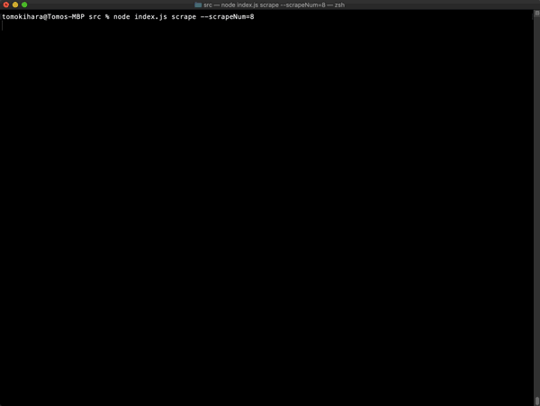
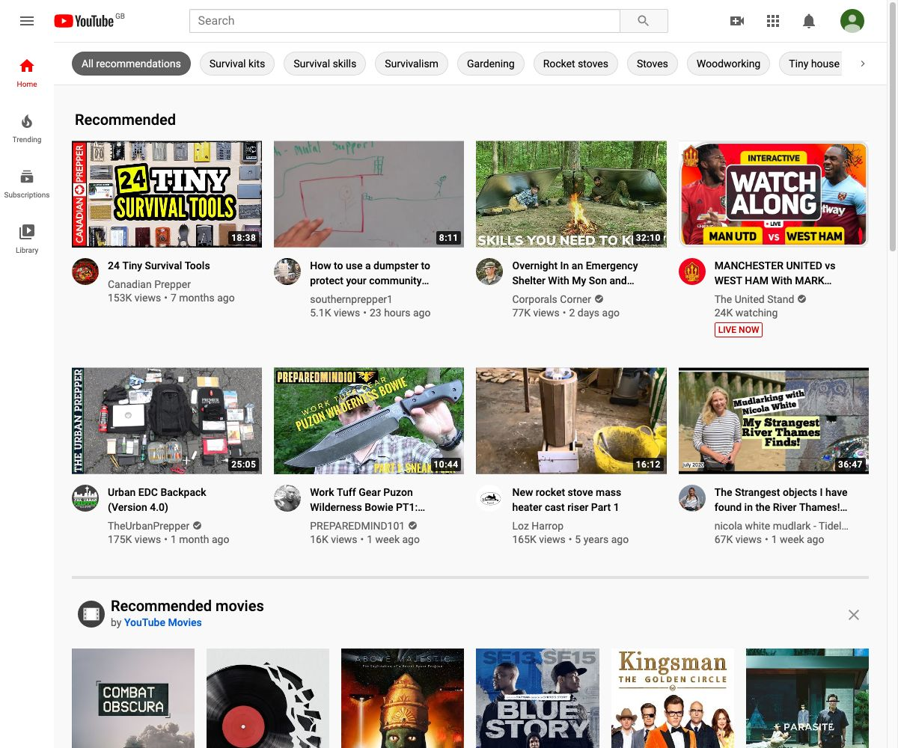

# TheirTube Scraper

Theirtube is a Youtube filter bubble simulator that provides a look into how videos are recommended on other people's YouTube.  🔗[their.tube](https://www.their.tube). 

TheirTube scraper allows to retireve your own Youtube recommendation results on your local environment




## Installation

The main dependancy of theirtube is [puppeteer](https://github.com/puppeteer/puppeteer) ver 2.1.1,  [node-schedule](https://www.npmjs.com/package/node-schedule) ver 1.3.2 running on node.js ver 12


```javascript
git clone https://github.com/kihapper/TheirTube.git

cd TheirTube

npm install 

npm run scrape
```
When activating for the first time, it will require you to login to your Youtube account on puppeteer. When you login, your login-cookie information will be saved under __/cookies/theirtube_cookie__ , allowing you to access to your Youtube accout on the next run scrape command. When you want to switch between accounts, swap this cookie to login to different channels.


## Usage

By default you can run the scraper everyday at a certain time. To specify when the program will run,you can set up a timer for a scheduled run. For instance, the below code will activate everyday on __17:31__ your local time.

```javascript
npm run scrape -- --scrapeHour=17 --scrapeMinute=31 
```
### Data Structure

The youtube top page will be saved in the following JSON format. You can specify where you want to save your files in theirtube.js


```json
    {
     "title": "Video Title",
     "url": "https://www.youtube.com/VIDEO-URL",
     "channel": "Channel Name",
     "channel_url": "https://www.youtube.com/CHANNEL-URL",
     "channel_icon": "https://www.youtube.com/CHANNEL-ICON-URL.jpg",
     "thumbnail": "https://www.youtube.com/THUMBNAIL-URL",
     "viewnum": "XX views",
     "date": "XX days ago"
    }
```


## Screenshot

Everytime it gets the data, it will also get a screenshot of the Youtube top-page. You can see them in the __/screenshot/images__ folder.

```javascript
.
├── screenshot
│   └── 2020-07-22
│       ├── 2020-07-22persona1.jpg
│       ├── 2020-07-22persona2.jpg
│       ├── 2020-07-22persona3.jpg

```



